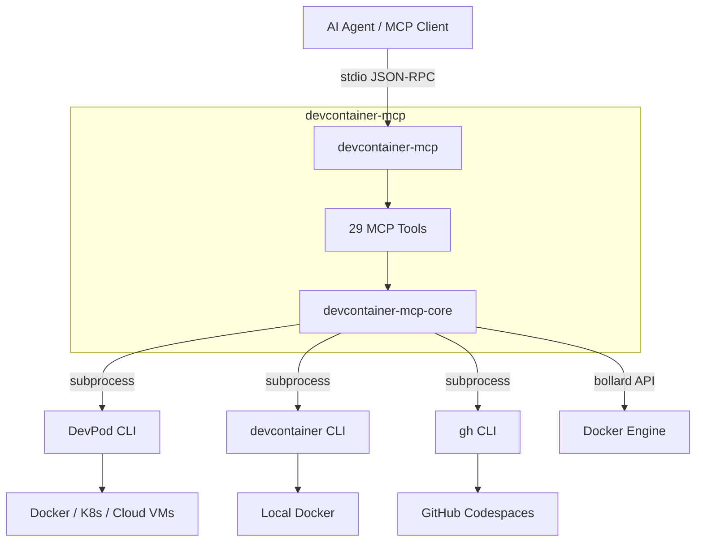

# devcontainer-mcp

[](https://github.com/aniongithub/devcontainer-mcp/actions/workflows/ci.yml)

A unified MCP server that gives AI coding agents full control over dev container environments across **three backends** — so work happens inside the right container, not on the host.

## Quick Install

```bash
# Install MCP server + all backend CLIs
curl -fsSL https://raw.githubusercontent.com/aniongithub/devcontainer-mcp/main/install.sh | bash

# Or pick specific backends
curl -fsSL ... | bash -s -- --backends devpod,codespaces
```

Binaries are available for **linux-x64**, **linux-arm64**, **darwin-x64**, and **darwin-arm64**.

## Why?

AI coding agents suffer from **Host Contamination** and **Context Drift**. They install packages on the host, assume local dependencies exist, and produce code that works "on my machine" but fails in production.

The [devcontainer spec](https://containers.dev/) solves this with reproducible, container-based environments. **This project** bridges the gap by exposing every dev container operation as MCP tools that AI agents can call directly — across multiple backends.

## Architecture



## Backends

| Backend | Best for | Requires |
|---------|----------|----------|
| **DevPod** (`devpod_*`) | Multi-provider: Docker, K8s, AWS, GCP, etc. | [DevPod CLI](https://devpod.sh) |
| **devcontainer CLI** (`devcontainer_*`) | Local Docker development | [@devcontainers/cli](https://github.com/devcontainers/cli) |
| **Codespaces** (`codespaces_*`) | GitHub-hosted cloud environments | [gh CLI](https://cli.github.com/) + auth |

## MCP Tools

### DevPod (15 tools)

#### Workspace Lifecycle
| Tool | Description |
|------|-------------|
| `devpod_up` | Create and start a workspace from a git URL, local path, or image |
| `devpod_stop` | Stop a running workspace |
| `devpod_delete` | Delete a workspace and its resources |
| `devpod_build` | Build a workspace image without starting it |
| `devpod_status` | Get workspace state (`Running`, `Stopped`, `Busy`, `NotFound`) |
| `devpod_list` | List all workspaces with IDs, sources, providers, and status |

#### Command Execution
| Tool | Description |
|------|-------------|
| `devpod_ssh` | Execute a command inside a workspace via SSH |

#### Provider Management
| Tool | Description |
|------|-------------|
| `devpod_provider_list` | List all configured providers |
| `devpod_provider_add` | Add a new provider |
| `devpod_provider_delete` | Remove a provider |

#### Context Management
| Tool | Description |
|------|-------------|
| `devpod_context_list` | List all contexts |
| `devpod_context_use` | Switch to a different context |

#### Logs & Docker
| Tool | Description |
|------|-------------|
| `devpod_logs` | Get workspace logs |
| `devpod_container_inspect` | Direct Docker inspect for labels, ports, mounts |
| `devpod_container_logs` | Stream container logs via Docker API |

### devcontainer CLI (7 tools)

| Tool | Description |
|------|-------------|
| `devcontainer_up` | Create and start a dev container from a workspace folder |
| `devcontainer_exec` | Execute a command inside a running dev container |
| `devcontainer_build` | Build a dev container image |
| `devcontainer_read_config` | Read merged devcontainer configuration as JSON |
| `devcontainer_stop` | Stop a dev container (via Docker API) |
| `devcontainer_remove` | Remove a dev container and its resources |
| `devcontainer_status` | Get dev container state by workspace folder |

### GitHub Codespaces (7 tools)

| Tool | Description |
|------|-------------|
| `codespaces_create` | Create a new codespace for a repository |
| `codespaces_list` | List your codespaces with state and machine info |
| `codespaces_ssh` | Execute a command inside a codespace via SSH |
| `codespaces_stop` | Stop a running codespace |
| `codespaces_delete` | Delete a codespace |
| `codespaces_view` | View detailed codespace info (state, machine, config) |
| `codespaces_ports` | List forwarded ports with visibility and URLs |

## MCP Server Configuration

### Claude Desktop

```json
{
  "mcpServers": {
    "devcontainer-mcp": {
      "command": "devcontainer-mcp",
      "args": ["serve"]
    }
  }
}
```

### Cursor

Add to your MCP settings:
```json
{
  "devcontainer-mcp": {
    "command": "devcontainer-mcp",
    "args": ["serve"]
  }
}
```

## Prerequisites

At least one backend CLI must be installed:

- **DevPod**: [DevPod CLI](https://devpod.sh/docs/getting-started/install) + [Docker](https://docs.docker.com/get-docker/) (or another provider)
- **devcontainer CLI**: `npm install -g @devcontainers/cli` + [Docker](https://docs.docker.com/get-docker/)
- **Codespaces**: [GitHub CLI](https://cli.github.com/) authenticated with `gh auth login`

## Self-Healing Loop

When `devpod_up` or `devcontainer_up` fails (bad Dockerfile, missing dependency, etc.), the full build output — including error messages — is returned to the AI agent. The agent can then:

1. Read the error from `stderr`
2. Fix the `Dockerfile` or `devcontainer.json`
3. Call the up command again
4. Repeat until the environment builds successfully

This makes the dev environment a **dynamic, agent-managed asset** rather than a static prerequisite.

## Development

This project eats its own dogfood — development happens inside a DevPod workspace.

```bash
# Create and start the dev workspace
devpod up . --id devcontainer-mcp --provider docker --open-ide=false

# Build inside the workspace
devpod ssh devcontainer-mcp --command "cd /workspaces/devcontainer-mcp && cargo build --workspace"

# Run tests
devpod ssh devcontainer-mcp --command "cd /workspaces/devcontainer-mcp && cargo test --workspace"

# Build release binary
devpod ssh devcontainer-mcp --command "cd /workspaces/devcontainer-mcp && cargo build --release -p devcontainer-mcp"
```

### CI/CD

- **Pull Requests** — `cargo check`, `cargo test`, `cargo clippy`, `cargo fmt` run automatically
- **Releases** — Creating a GitHub release builds binaries for all 4 platforms and uploads them as release assets

## License

[MIT](LICENSE)
