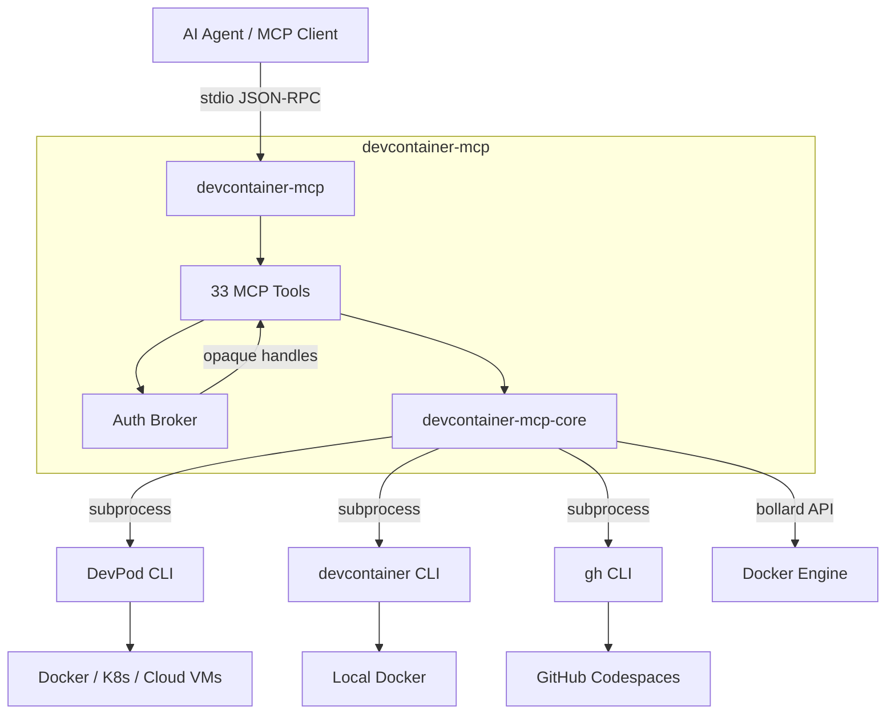

# devcontainer-mcp

[](https://github.com/aniongithub/devcontainer-mcp/actions/workflows/ci.yml)

**Give your AI agent its own dev environment — not yours.**

`devcontainer-mcp` is an MCP server that lets AI coding agents create, manage, and work inside [dev containers](https://containers.dev/) across three backends: local Docker, [DevPod](https://devpod.sh/), and [GitHub Codespaces](https://github.com/features/codespaces). The agent builds, tests, and ships code in an isolated container — your laptop stays clean.

## The Problem

When AI agents write code, they need to run it somewhere. Today that means your host machine:

- 🔴 **Host contamination** — agents install packages, modify PATH, leave behind build artifacts
- 🔴 **"Works on my machine"** — agents assume your local toolchain matches production
- 🔴 **No isolation** — one project's dependencies break another
- 🔴 **Security risk** — agents run arbitrary commands with your user privileges

## The Solution

The [devcontainer spec](https://containers.dev/) already defines reproducible, container-based dev environments. Every major project ships a `.devcontainer/devcontainer.json`. But AI agents can't use them — until now.

`devcontainer-mcp` exposes **33 MCP tools** that let any AI agent:

1. **Spin up** a dev container from any repo — locally, on a cloud VM, or in Codespaces
2. **Run commands** inside the container — builds, tests, linting, anything
3. **Manage the lifecycle** — stop, restart, delete when done
4. **Authenticate** against cloud providers — GitHub, AWS, Azure, GCP — without ever seeing a raw token

```
Agent: "Let me build this project..."
  → auth_status("github") → picks account
  → codespaces_create(auth: "github-you", repo: "your/repo")
  → codespaces_ssh(auth: "github-you", codespace: "...", command: "cargo build")
  → ✅ Built in the cloud. Your laptop did nothing.
```

## Quick Install

### Linux / macOS

```bash
curl -fsSL https://raw.githubusercontent.com/aniongithub/devcontainer-mcp/main/install.sh | bash
```

### Windows (via WSL)

```powershell
Invoke-RestMethod https://github.com/aniongithub/devcontainer-mcp/releases/latest/download/install.ps1 | Invoke-Expression
```

> **How it works:** The binary runs inside WSL; MCP clients on Windows launch it via `wsl ~/.local/bin/devcontainer-mcp serve`. The stdio transport works transparently across the WSL boundary. WSL 2 is required — install it with `wsl --install` if you haven't already.

Backend CLIs (`devpod`, `devcontainer`, `gh`) are detected at runtime — if one is missing, the MCP server returns a helpful error with install instructions.

Binaries available for **linux-x64**, **linux-arm64**, **darwin-x64**, and **darwin-arm64**.

## Architecture



## Three Backends, One Interface

| Backend | Best for | Requires | Auth needed? |
|---------|----------|----------|:---:|
| **devcontainer CLI** (`devcontainer_*`) | Local Docker — fast, simple | [@devcontainers/cli](https://github.com/devcontainers/cli) + Docker | No |
| **DevPod** (`devpod_*`) | Multi-cloud: Docker, K8s, AWS, Azure, GCP | [DevPod CLI](https://devpod.sh) | Optional (cloud providers) |
| **Codespaces** (`codespaces_*`) | GitHub-hosted cloud environments | [gh CLI](https://cli.github.com/) | Yes (`auth` handle) |

## Auth Broker

The agent never sees raw tokens. Instead:

1. **`auth_status(provider)`** — list available accounts and scopes
2. **`auth_login(provider, scopes?)`** — initiate login, opens browser, handles device codes
3. **`auth_select(id)`** — switch the active account
4. **`auth_logout(id)`** — revoke credentials

Codespaces tools require an auth handle (e.g. `"github-aniongithub"`). The MCP server resolves it to the real token on each call via the CLI's native keyring.

Supported providers: **GitHub**, **AWS**, **Azure**, **GCP**, **Kubernetes**

## MCP Tools (33 total)

### Auth (4 tools)

| Tool | Description |
|------|-------------|
| `auth_status` | Check auth for a provider — returns handles, accounts, scopes |
| `auth_login` | Initiate login or refresh scopes — browser + device code flow |
| `auth_select` | Switch the active account for a provider |
| `auth_logout` | Revoke credentials for an account |

### DevPod (15 tools)

| Tool | Description |
|------|-------------|
| `devpod_up` | Create and start a workspace from a git URL, local path, or image |
| `devpod_stop` | Stop a running workspace |
| `devpod_delete` | Delete a workspace and its resources |
| `devpod_build` | Build a workspace image without starting it |
| `devpod_status` | Get workspace state (`Running`, `Stopped`, `Busy`, `NotFound`) |
| `devpod_list` | List all workspaces with IDs, sources, providers, and status |
| `devpod_ssh` | Execute a command inside a workspace via SSH |
| `devpod_logs` | Get workspace logs |
| `devpod_provider_list` | List all configured providers |
| `devpod_provider_add` | Add a new provider |
| `devpod_provider_delete` | Remove a provider |
| `devpod_context_list` | List all contexts |
| `devpod_context_use` | Switch to a different context |
| `devpod_container_inspect` | Docker inspect — labels, ports, mounts, state |
| `devpod_container_logs` | Stream container logs via Docker API |

### devcontainer CLI (7 tools)

| Tool | Description |
|------|-------------|
| `devcontainer_up` | Create and start a local dev container |
| `devcontainer_exec` | Execute a command inside a running dev container |
| `devcontainer_build` | Build a dev container image |
| `devcontainer_read_config` | Read merged devcontainer configuration as JSON |
| `devcontainer_stop` | Stop a dev container (via Docker API) |
| `devcontainer_remove` | Remove a dev container and its resources |
| `devcontainer_status` | Get dev container state by workspace folder |

### GitHub Codespaces (7 tools) — require `auth` handle

| Tool | Description |
|------|-------------|
| `codespaces_create` | Create a new codespace for a repository |
| `codespaces_list` | List your codespaces with state and machine info |
| `codespaces_ssh` | Execute a command inside a codespace via SSH |
| `codespaces_stop` | Stop a running codespace |
| `codespaces_delete` | Delete a codespace |
| `codespaces_view` | View detailed codespace info (state, machine, config) |
| `codespaces_ports` | List forwarded ports with visibility and URLs |

## MCP Server Configuration

### Linux / macOS

```json
{
  "mcpServers": {
    "devcontainer-mcp": {
      "command": "devcontainer-mcp",
      "args": ["serve"]
    }
  }
}
```

### Windows (WSL bridge)

```json
{
  "mcpServers": {
    "devcontainer-mcp": {
      "command": "wsl",
      "args": ["~/.local/bin/devcontainer-mcp", "serve"]
    }
  }
}
```

## Prerequisites

Install backend CLIs as needed — the MCP server detects them at runtime and returns helpful errors if missing:

- **devcontainer CLI**: `npm install -g @devcontainers/cli` + [Docker](https://docs.docker.com/get-docker/)
- **DevPod**: [DevPod CLI](https://devpod.sh/docs/getting-started/install) + Docker (or another provider)
- **Codespaces**: [GitHub CLI](https://cli.github.com/) — auth is handled by the `auth_login` tool

## Self-Healing

When `devcontainer_up`, `devpod_up`, or `codespaces_create` fails, the full build output (including errors) is returned to the agent. The agent can read the error, fix the `Dockerfile` or `devcontainer.json`, and retry — making the dev environment a **dynamic, agent-managed asset** rather than a static prerequisite.

## Development

This project eats its own dogfood — development happens inside its own devcontainer.

```bash
# Using the devcontainer CLI
devcontainer up --workspace-folder .
devcontainer exec --workspace-folder . cargo build --workspace
devcontainer exec --workspace-folder . cargo test --workspace
devcontainer exec --workspace-folder . cargo build --release -p devcontainer-mcp

# Or using DevPod
devpod up . --id devcontainer-mcp --provider docker --open-ide=false
devpod ssh devcontainer-mcp --command "cd /workspaces/devcontainer-mcp && cargo build --workspace"
```

### CI/CD

- **Pull Requests** — `cargo check`, `cargo test`, `cargo clippy`, `cargo fmt` run automatically
- **Releases** — Creating a GitHub release builds binaries for all 4 platforms

## License

[MIT](LICENSE)
