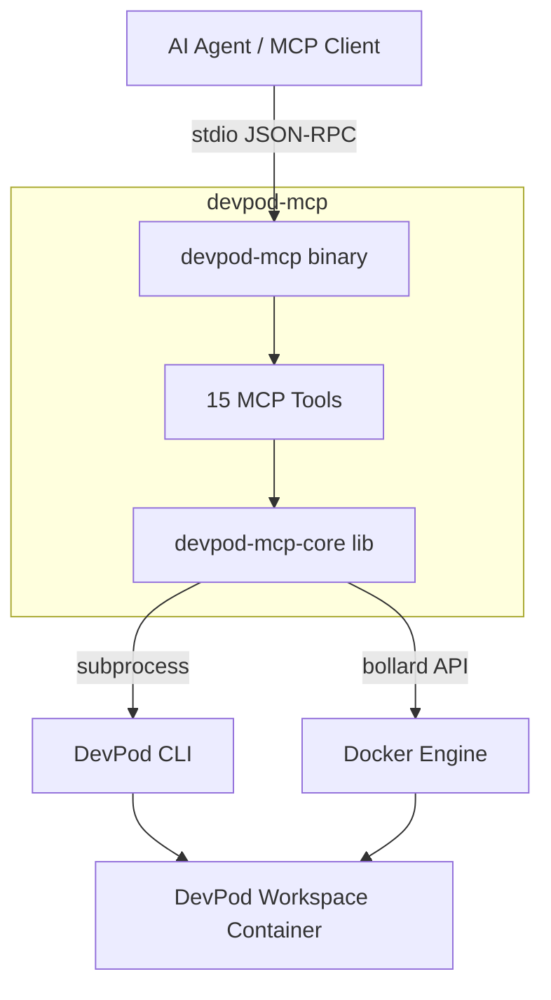

# devpod-mcp

[](https://github.com/aniongithub/devpod-mcp/actions/workflows/ci.yml)

An MCP server that wraps the [DevPod](https://devpod.sh/) CLI to give AI coding agents full control over isolated development environments — so work happens inside the right container, not on the host.


## Quick Install

```bash
# Install MCP server + DevPod CLI (auto-detects OS/arch, installs DevPod if missing)
curl -fsSL https://raw.githubusercontent.com/aniongithub/devpod-mcp/main/install.sh | bash
```

Binaries are available for **linux-x64**, **linux-arm64**, **darwin-x64**, and **darwin-arm64**.

## Why?

AI coding agents suffer from **Host Contamination** and **Context Drift**. They install packages on the host, assume local dependencies exist, and produce code that works "on my machine" but fails in production.

[DevPod](https://github.com/loft-sh/devpod) solves the hard container management problem — supporting Docker, Kubernetes, cloud VMs, compose, and more. **This project** bridges the gap by exposing every DevPod capability as MCP tools that AI agents can call directly.

## Architecture



## MCP Tools

### Workspace Lifecycle
| Tool | Description |
|------|-------------|
| `devpod_up` | Create and start a workspace from a git URL, local path, or image. Returns full build output for self-healing. |
| `devpod_stop` | Stop a running workspace |
| `devpod_delete` | Delete a workspace and its resources |
| `devpod_build` | Build a workspace image without starting it |
| `devpod_status` | Get workspace state (`Running`, `Stopped`, `Busy`, `NotFound`) as JSON |
| `devpod_list` | List all workspaces with IDs, sources, providers, and status |

### Command Execution
| Tool | Description |
|------|-------------|
| `devpod_ssh` | Execute a command inside a workspace via SSH. Returns stdout, stderr, and exit code. |

### Provider Management
| Tool | Description |
|------|-------------|
| `devpod_provider_list` | List all configured providers |
| `devpod_provider_add` | Add a new provider |
| `devpod_provider_delete` | Remove a provider |

### Context Management
| Tool | Description |
|------|-------------|
| `devpod_context_list` | List all contexts |
| `devpod_context_use` | Switch to a different context |

### Logs & Docker
| Tool | Description |
|------|-------------|
| `devpod_logs` | Get workspace logs (useful for diagnosing build failures) |
| `devpod_container_inspect` | Direct Docker inspect for labels, ports, mounts |
| `devpod_container_logs` | Stream container logs via Docker API (bollard) |

## MCP Server Configuration

### Claude Desktop

```json
{
  "mcpServers": {
    "devpod-mcp": {
      "command": "devpod-mcp",
      "args": ["serve"]
    }
  }
}
```

### Cursor

Add to your MCP settings:
```json
{
  "devpod-mcp": {
    "command": "devpod-mcp",
    "args": ["serve"]
  }
}
```

## Prerequisites

- [DevPod](https://devpod.sh/docs/getting-started/install) CLI installed (or use `--with-devpod` in the install script)
- [Docker](https://docs.docker.com/get-docker/) (or another DevPod provider like Kubernetes)

## Self-Healing Loop

When `devpod_up` fails (bad Dockerfile, missing dependency, etc.), the full build output — including error messages — is returned to the AI agent. The agent can then:

1. Read the error from `stderr`
2. Fix the `Dockerfile` or `devcontainer.json`
3. Call `devpod_up` again with `--recreate`
4. Repeat until the environment builds successfully

This makes the dev environment a **dynamic, agent-managed asset** rather than a static prerequisite.

## Development

This project eats its own dogfood — development happens inside a DevPod workspace.

```bash
# Create and start the dev workspace
devpod up . --id devpod-mcp --provider docker --open-ide=false

# Build inside the workspace
devpod ssh devpod-mcp --command "cd /workspaces/devpod-mcp && cargo build --workspace"

# Run tests
devpod ssh devpod-mcp --command "cd /workspaces/devpod-mcp && cargo test --workspace"

# Build release binary
devpod ssh devpod-mcp --command "cd /workspaces/devpod-mcp && cargo build --release -p devpod-mcp"
```

### CI/CD

- **Pull Requests** — `cargo check`, `cargo test`, `cargo clippy`, `cargo fmt` run automatically
- **Releases** — Creating a GitHub release builds binaries for all 4 platforms and uploads them as release assets

## License

[MIT](LICENSE)
